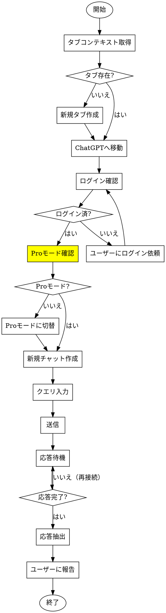

# ChatGPT Pro へのブラウザ自動化クエリ

## 概要

Claude in Chrome MCP ツールを使用して ChatGPT Pro に質問を送信し、拡張思考（Extended Thinking）の回答を取得するワークフロー。ChatGPT Pro の Web検索・深い推論機能を活用した調査タスクに使用。

## 使用するタイミング

- ChatGPT Pro に調査クエリを送りたい
- 拡張思考（15-20分以上かかる深い推論）が必要な質問
- 複数AIモデルの回答を比較したい
- Web検索を伴う最新情報の調査
- 「ChatGPTに聞いて」「GPTで調べて」と言われた時

## 前提条件

- Chrome で ChatGPT Pro にログイン済み
- Claude in Chrome 拡張機能がインストール済み
- ユーザーがパスワード入力を自分で完了していること（自動ログイン不可）

## 基本ワークフロー



## クイックリファレンス

| ステップ | ツール | パラメータ |
|---------|--------|-----------|
| コンテキスト取得 | `tabs_context_mcp` | `createIfEmpty: true` |
| タブ作成 | `tabs_create_mcp` | - |
| ページ移動 | `navigate` | `url: "https://chatgpt.com"`, `tabId` |
| スクリーンショット | `computer` | `action: "screenshot"`, `tabId` |
| クリック | `computer` | `action: "left_click"`, `coordinate`, `tabId` |
| 要素ref取得 | `read_page` | `tabId`, `filter: "interactive"` |
| 長文入力（推奨） | `form_input` | `ref`, `value`, `tabId` |
| 短文入力 | `computer` | `action: "type"`, `text`, `tabId` |
| JS実行 | `javascript_tool` | `action: "javascript_exec"`, `text`, `tabId` |
| 待機 | `computer` | `action: "wait"`, `duration` (最大30秒), `tabId` |
| テキスト抽出 | `get_page_text` | `tabId` |

## 実装手順

### 1. ブラウザコンテキストの初期化

```
tabs_context_mcp を createIfEmpty: true で呼び出し
→ レスポンスから tabId を取得
→ 適切なタブがなければ tabs_create_mcp を使用
```

### 2. ChatGPT へ移動

```
navigate で "https://chatgpt.com" に移動（tabId指定）
screenshot でページ読み込みを確認
```

### 3. ログイン状態の確認

スクリーンショットで以下を確認：
- 「ChatGPT X.X Pro」表示 → Proでログイン済み
- ログインフォーム表示 → 未ログイン（ユーザーに依頼）
- モデルセレクター表示 → 使用準備完了

### 4. Proモードの確認・切り替え（重要）

**注意:** 「ChatGPT 5.2」と表示されていても、Proモードではない場合がある。必ず確認すること。

```
1. 左上のモデル名（例: "ChatGPT 5.2"）をクリック
   computer action: "left_click", coordinate: [290, 21], tabId

2. ドロップダウンメニューが表示される:
   - Auto（思考時間を自動調整）
   - Instant（瞬時に回答）
   - Thinking（より良い回答のために長く思考）
   - Pro（研究レベルのインテリジェンス）← これを選択

3. 「Pro」をクリック
   computer action: "left_click", coordinate: [250, 217], tabId

4. 確認ポイント:
   ✅ ヘッダーが「ChatGPT 5.2 Pro」に変わる
   ✅ 入力エリアに「思考の拡張」オプションが表示される
```

**Proモード選択後の画面:**
- ヘッダー: 「ChatGPT 5.2 Pro」
- 入力エリア: 「+ 思考の拡張 ∨」ボタンが表示

### 5. 新規チャット作成（必要に応じて）

```
「新しいチャット」ボタンをクリック
座標は通常 [65, 63] 付近（サイドバーボタン）
```

### 6. クエリ送信

**重要:** 長いテキストは `type` を使うと分断される。必ず `form_input` または `javascript_tool` を使用すること。

#### 方法A: form_input を使用（推奨）

```
1. read_page で textarea の ref を取得
   read_page tabId, filter: "interactive"
   → 出力から textarea [ref=ref_X] を探す

2. form_input で値を直接設定
   form_input ref: "ref_X", value: "完全なクエリテキスト", tabId

3. 送信ボタンをクリック
   computer action: "left_click", coordinate: [1018, 657], tabId
```

#### 方法B: javascript_tool を使用

```
1. JavaScript で textarea に値を設定
   javascript_tool action: "javascript_exec", tabId, text:
   "document.querySelector('#prompt-textarea').value = '完全なクエリテキスト'"

2. 入力イベントを発火（React対応）
   javascript_tool action: "javascript_exec", tabId, text:
   "document.querySelector('#prompt-textarea').dispatchEvent(new Event('input', {bubbles: true}))"

3. 送信ボタンをクリック
   computer action: "left_click", coordinate: [1018, 657], tabId
```

#### 注意: computer type は使用禁止

```
❌ 以下は長文で分断される原因となるため使用しない:
   computer action: "type", text: "長いテキスト..."

✅ 短い単語（検索キーワード等）のみ type を使用可
```

### 7. 拡張思考の待機

**重要:** ChatGPT Pro の拡張思考は15-20分以上かかることがある

```
ループ:
  1. 30秒待機（最大待機時間）
  2. 拡張機能が切断された場合 → tabs_context_mcp で再接続
  3. スクリーンショット取得
  4. 以下を確認:
     - 「Thought for Xm Xs」表示 → まだ思考中
     - アクションボタン（コピー、いいね）表示 → 応答完了
  5. 完了していなければ → ループ継続
```

### 8. 応答の抽出

```
get_page_text を tabId で呼び出し
→ 会話全文のテキストを取得
→ ChatGPT の応答部分を解析
```

## 拡張機能の切断対応

長時間の待機中にブラウザ拡張機能が頻繁に切断される。対処法：

```
「Browser extension is not connected」エラーが出た場合:
  1. tabs_context_mcp を createIfEmpty: true で呼び出し
  2. tabId が有効か確認
  3. 操作を継続
```

## よくあるミス

| ミス | 解決策 |
|-----|--------|
| **Proモードになっていない** | 左上のモデル名をクリックしてドロップダウンから「Pro」を選択。「ChatGPT 5.2 Pro」と表示されることを確認 |
| **長文が分断される** | `type` ではなく `form_input` または `javascript_tool` を使用 |
| 30秒以上の待機 | 30秒ループで待機、間に再接続 |
| 座標クリックミス | 必ず先にスクリーンショットで要素位置を確認 |
| 応答完了の見逃し | アクションボタン（コピー、👍👎）の有無で判定 |
| 拡張機能タイムアウト | 各待機後に tabs_context_mcp で再接続 |
| クエリ途切れ | 完全なクエリテキストを確認してから送信 |
| form_input後に送信されない | 入力後に送信ボタンを明示的にクリック |
| JS設定後にReactが認識しない | `dispatchEvent(new Event('input'))` で入力イベント発火 |

## 応答状態の判定

**処理中:**
- 「Pro が思考中です」表示
- 「Thought for Xm Xs」とタイマー増加中
- ローディングスピナー表示

**完了:**
- アクションボタン表示（コピー、いいね、よくないね、再生成）
- 「情報源」セクション表示
- ローディング表示なし

## 実行例

```
ユーザー: 「Claude Code Skills トップ10を調べて」

1. tabs_context_mcp → tabId: 123456
2. chatgpt.com へ移動
3. スクリーンショット → Proでログイン済みを確認
4. 新規チャットボタンをクリック [65, 63]
5. read_page filter: "interactive" → textarea の ref を取得（例: ref_5）
6. form_input ref: "ref_5", value: "Claude Codeで最も使われているSkillsトップ10を調べてください"
7. 送信ボタンをクリック [1018, 657]
8. 待機ループ（通常15-20分）
   - 30秒待機 → スクリーンショット → 状態確認 → 必要なら再接続
9. get_page_text → 応答を抽出
10. ユーザーに結果を報告
```

### 長文クエリの例（form_input使用）

```
クエリ: 複数行の詳細な質問

1. read_page → ref_5 (textarea)
2. form_input ref: "ref_5", value: "以下の設計についてレビューをお願いします。

   【要件】
   - 用途: ビジネスアイデア・企画立案
   - AI連携: Codex(CLI)、Gemini/ChatGPT
   - ワークフロー: 並列/リレー/役割分担

   【質問】
   改善点があれば教えてください。"
3. 送信ボタンをクリック
```

## 制限事項

- パスワード入力は禁止（ユーザーが事前にログイン必要）
- CAPTCHA/2FA は自動化不可
- 拡張思考は予測不能な時間がかかる（5分〜30分+）
- Browser extension は30秒以上の待機で切断される傾向

## 自動実行される操作

以下のアクションはユーザー許可なしで自動実行する:
- メッセージ送信（送信ボタンのクリック）
- フォーム入力（テキストエリアへの入力）

**注意:** このスキルが呼び出された時点で、ユーザーはChatGPT Proへのクエリ送信を意図しているため、確認なしで自動送信する。
