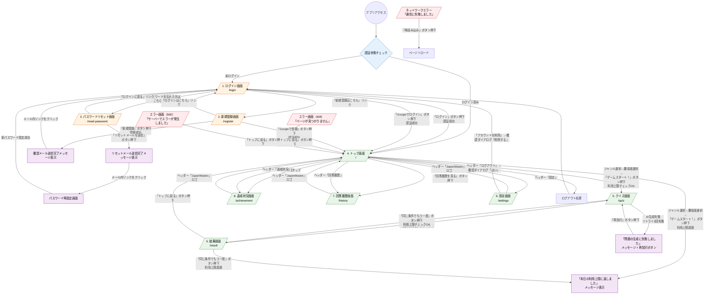
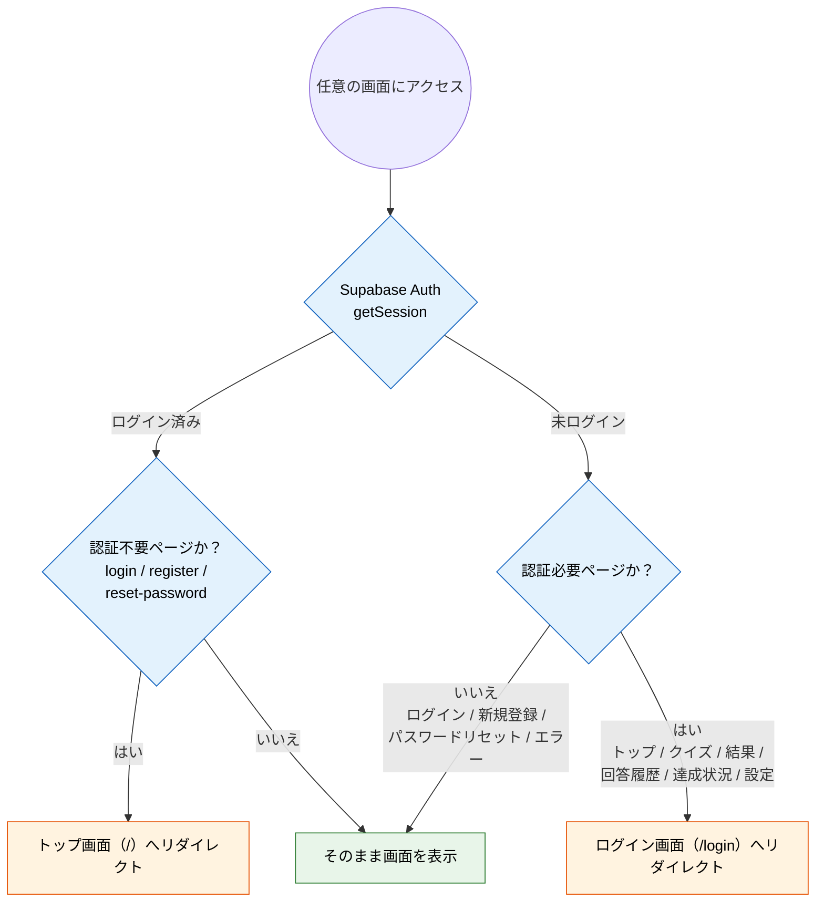
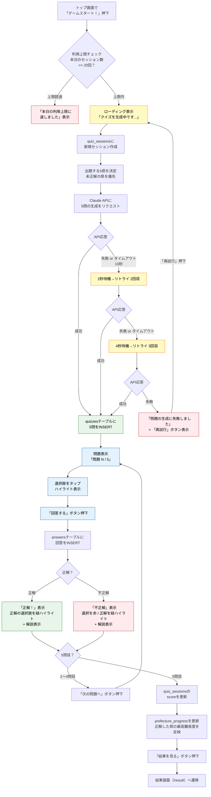
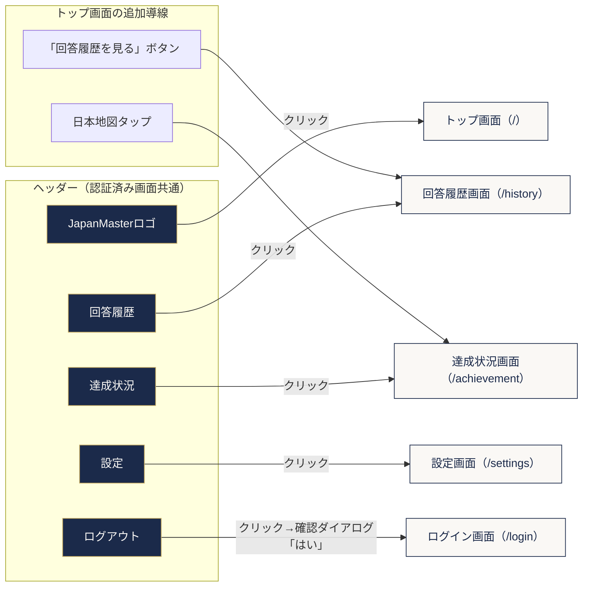

# JapanMaster 画面遷移図

> 要件定義書・機能要件書に基づく全画面の遷移を網羅した文書。

---

## 1. 画面一覧

| # | 画面名 | パス | 認証要否 | ヘッダー表示 |
|---|--------|------|----------|-------------|
| 1 | ログイン画面 | `/login` | 不要（ログイン済みならトップへリダイレクト） | 非表示 |
| 2 | 新規登録画面 | `/register` | 不要（ログイン済みならトップへリダイレクト） | 非表示 |
| 3 | パスワードリセット画面 | `/reset-password` | 不要（ログイン済みならトップへリダイレクト） | 非表示 |
| 4 | トップ画面 | `/` | 必須 | 表示 |
| 5 | クイズ画面 | `/quiz` | 必須 | 表示 |
| 6 | 結果画面 | `/result` | 必須 | 表示 |
| 7 | 回答履歴画面 | `/history` | 必須 | 表示 |
| 8 | 達成状況画面 | `/achievement` | 必須 | 表示 |
| 9 | 設定画面 | `/settings` | 必須 | 表示 |
| 10 | エラー画面（404） | - | - | 表示 |
| 11 | エラー画面（500） | - | - | 表示 |
| 12 | ネットワークエラー | - | - | 表示 |

---

## 2. 画面遷移図（メインフロー）

---

## 3. 認証ガードフロー

---

## 4. クイズフロー詳細

---

## 5. ナビゲーション構造

---

## 6. 画面遷移一覧表

### 6.1 認証系画面の遷移

| # | 遷移元 | 遷移先 | トリガー | 条件 |
|---|--------|--------|----------|------|
| 1 | ログイン画面 | トップ画面（/） | 「ログイン」ボタン押下 | 認証成功 |
| 2 | ログイン画面 | トップ画面（/） | 「Googleでログイン」ボタン押下 | Google認証成功 |
| 3 | ログイン画面 | 新規登録画面 | 「新規登録はこちら」リンククリック | なし |
| 4 | ログイン画面 | パスワードリセット画面 | 「パスワードを忘れた方はこちら」リンククリック | なし |
| 5 | 新規登録画面 | 確認メール送信完了メッセージ | 「新規登録」ボタン押下 | 登録成功 |
| 6 | 新規登録画面 | トップ画面（/） | 「Googleで登録」ボタン押下 | Google認証成功 |
| 7 | 新規登録画面 | ログイン画面 | 「ログインはこちら」リンククリック | なし |
| 8 | 確認メール | ログイン画面 | メール内リンクをクリック | メール認証完了 |
| 9 | パスワードリセット画面 | リセットメール送信完了メッセージ | 「リセットメールを送信」ボタン押下 | なし |
| 10 | パスワードリセット画面 | ログイン画面 | 「ログインに戻る」リンククリック | なし |
| 11 | リセットメール | パスワード再設定画面 | メール内リンクをクリック | なし |
| 12 | パスワード再設定画面 | ログイン画面 | 新パスワード設定成功 | パスワード更新成功 |

### 6.2 メイン画面の遷移

| # | 遷移元 | 遷移先 | トリガー | 条件 |
|---|--------|--------|----------|------|
| 13 | トップ画面 | クイズ画面 | 「ゲームスタート！」ボタン押下 | ジャンル・難易度選択済み かつ 利用上限内 |
| 14 | トップ画面 | （利用上限メッセージ表示） | 「ゲームスタート！」ボタン押下 | 利用上限超過（本日20回以上） |
| 15 | トップ画面 | 達成状況画面 | 日本地図タップ | なし |
| 16 | トップ画面 | 回答履歴画面 | 「回答履歴を見る」ボタン押下 | なし |
| 17 | クイズ画面 | 結果画面 | 5問目回答後「結果を見る」ボタン押下 | 5問回答完了 |
| 18 | クイズ画面 | （エラーメッセージ表示） | AI生成リトライ3回失敗 | 全リトライ失敗 |
| 19 | クイズ画面（エラー） | クイズ画面（再生成） | 「再試行」ボタン押下 | なし |
| 20 | 結果画面 | クイズ画面 | 「同じ条件でもう一度」ボタン押下 | 利用上限内 |
| 21 | 結果画面 | （利用上限メッセージ表示） | 「同じ条件でもう一度」ボタン押下 | 利用上限超過 |
| 22 | 結果画面 | トップ画面 | 「トップに戻る」ボタン押下 | なし |

### 6.3 ナビゲーション（ヘッダー/ハンバーガーメニュー共通）

| # | 遷移元 | 遷移先 | トリガー | 条件 |
|---|--------|--------|----------|------|
| 23 | 認証済み全画面 | トップ画面 | ヘッダー「JapanMaster」ロゴクリック | ログイン済み |
| 24 | 認証済み全画面 | 回答履歴画面 | ヘッダー/メニュー「回答履歴」クリック | ログイン済み |
| 25 | 認証済み全画面 | 達成状況画面 | ヘッダー/メニュー「達成状況」クリック | ログイン済み |
| 26 | 認証済み全画面 | 設定画面 | ヘッダー/メニュー「設定」クリック | ログイン済み |
| 27 | 認証済み全画面 | ログイン画面 | ヘッダー/メニュー「ログアウト」クリック→確認ダイアログ「はい」 | ログイン済み |

### 6.4 設定画面の遷移

| # | 遷移元 | 遷移先 | トリガー | 条件 |
|---|--------|--------|----------|------|
| 28 | 設定画面 | （成功メッセージ表示） | 「パスワードを変更」ボタン押下 | パスワード変更成功 |
| 29 | 設定画面 | ログイン画面 | 「アカウントを削除」→確認ダイアログ「削除する」 | アカウント削除成功 |

### 6.5 認証ガード（自動リダイレクト）

| # | 遷移元 | 遷移先 | トリガー | 条件 |
|---|--------|--------|----------|------|
| 30 | ログイン画面 | トップ画面 | ページアクセス時 | ログイン済みユーザー |
| 31 | 新規登録画面 | トップ画面 | ページアクセス時 | ログイン済みユーザー |
| 32 | パスワードリセット画面 | トップ画面 | ページアクセス時 | ログイン済みユーザー |
| 33 | トップ画面 | ログイン画面 | ページアクセス時 | 未ログインユーザー |
| 34 | クイズ画面 | ログイン画面 | ページアクセス時 | 未ログインユーザー |
| 35 | 結果画面 | ログイン画面 | ページアクセス時 | 未ログインユーザー |
| 36 | 回答履歴画面 | ログイン画面 | ページアクセス時 | 未ログインユーザー |
| 37 | 達成状況画面 | ログイン画面 | ページアクセス時 | 未ログインユーザー |
| 38 | 設定画面 | ログイン画面 | ページアクセス時 | 未ログインユーザー |
| 39 | クイズ画面 | トップ画面 | 直接URLアクセス時 | ジャンル・難易度が未選択 |
| 40 | 結果画面 | トップ画面 | 直接URLアクセス時 | セッションIDが存在しない |

### 6.6 エラー画面の遷移

| # | 遷移元 | 遷移先 | トリガー | 条件 |
|---|--------|--------|----------|------|
| 41 | エラー画面（404） | トップ画面 | 「トップに戻る」ボタン押下 | なし |
| 42 | エラー画面（500） | トップ画面 | 「トップに戻る」ボタン押下 | なし |
| 43 | ネットワークエラー | 現在のページ | 「再読み込み」ボタン押下 | なし |

---

## 7. クイズ中の離脱時の動作

| 状況 | 動作 | 遷移先 |
|------|------|--------|
| ブラウザを閉じた | 途中データは破棄。次回は最初から | - |
| ブラウザの戻るボタンを押した | 途中データは破棄。次回は最初から | 前の画面 |
| ネットワーク切断 | エラー表示。回答済みのデータは保存されない | ネットワークエラー表示 |

---

## 8. レスポンシブ対応時のナビゲーション差異

| 画面幅 | ナビゲーション方式 | 遷移トリガーの違い |
|--------|-------------------|-------------------|
| 768px以上（PC） | ヘッダーに「回答履歴」「達成状況」「設定」「ログアウト」ボタンを横並び表示 | 各ボタンを直接クリック |
| 767px以下（スマホ） | ハンバーガーメニュー（三本線アイコン）内に格納 | 三本線アイコンタップ→メニュー展開→各項目タップ |

※ 遷移先は同一。操作ステップがスマホ版では1段階多い（メニュー展開操作が追加される）。
